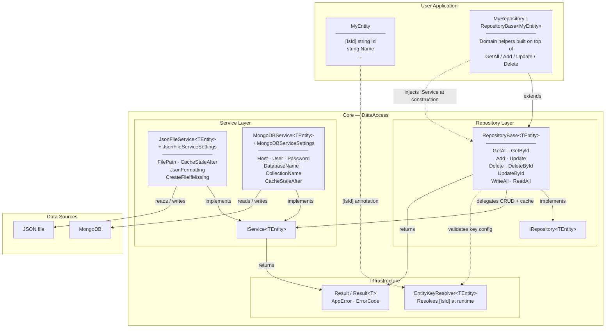
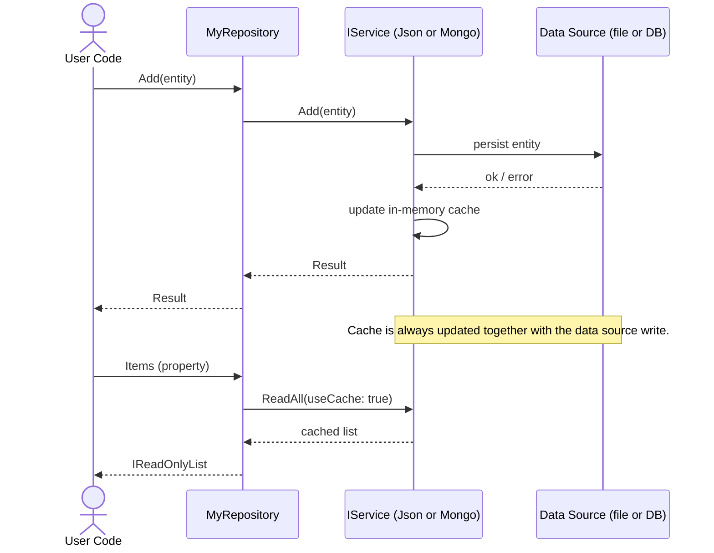

# Data Access Architecture

The data access system is split into three layers: **Entity**, **Repository**, and **Service**. Each layer has a single responsibility, and the user only needs to define the bottom and top of the stack — the middle is handled by the framework.

---

## Layer Overview



---

## Request Flow — Add an entity

The sequence below shows what happens when user code calls `myRepo.Add(entity)`.



---

## How to add a new entity type

### 1 — Define the entity and mark its key

```csharp
public class Book
{
    [IsId]
    public string Id { get; set; } = Guid.NewGuid().ToString();

    public string Title { get; set; } = string.Empty;
    public int Year { get; set; }
}
```

For composite keys, add `Order`:

```csharp
[IsId(Order = 0)] public string LibraryId { get; set; }
[IsId(Order = 1)] public string BookId { get; set; }
```

---

### 2 — Choose a service and configure its settings

**JSON file** (local persistence):

```csharp
var settings = new JsonFileServiceSettings
{
    FilePath = "books.json",
    CacheStaleAfter = TimeSpan.FromMinutes(10),
    JsonFormatting = Formatting.Indented,
    CreateFileIfMissing = true
};
IService<Book> svc = new JsonFileService<Book>(settings);
```

**MongoDB**:

```csharp
var settings = new MongoDBServiceSettings
{
    Host = "cluster.mongodb.net",
    User = "admin",
    Password = "secret",
    DatabaseName = "LibraryDB",
    CollectionName = "Books",
    AppName = "MyApp",
    CacheStaleAfter = TimeSpan.FromSeconds(30)
};
IService<Book> svc = new MongoDBService<Book>(settings);
```

The `Settings` property on both services is **mutable at runtime** — changes take effect on the next operation.

---

### 3 — Create a minimal repository

```csharp
public class BookRepository : RepositoryBase<Book>
{
    public BookRepository(IService<Book> svc) : base(svc) { }

    // Optional domain helpers:
    public List<Book> GetByYear(int year) =>
        Items.Where(b => b.Year == year).ToList();
}
```

That's it. `Add`, `Update`, `Delete`, `DeleteById`, `UpdateById`, `GetAll`, `GetById`, `Items`, `WriteAllToDataSource`, `ReadAllFromDataSource` are all provided by `RepositoryBase`.

---

## Key resolution rules

| Scenario | Result |
|---|---|
| One `[IsId]` property | Key is that property's value (`object`) |
| Multiple `[IsId]` properties | Key is a `CompositeKey` ordered by `Order` |
| No `[IsId]` property | Constructor throws `InvalidOperationException` at startup |

`EntityKeyResolver<TEntity>` caches the reflected `PropertyInfo[]` statically — resolution is only paid once per type.

---

## Error handling

All mutating methods return `Result` or `Result<T>`. No exceptions are thrown for expected failures.

```csharp
var result = repo.Add(book);
if (!result.IsSuccess)
{
    Console.WriteLine(result.Error!.ToUserMessage());
}
```

`AppError` carries:
- `ErrorCode` — category (`NotFound`, `Conflict`, `DataSource`, `Validation`, `Configuration`, `Timeout`, `Unknown`)
- `TechnicalMessage` — always set, developer-facing
- `UserMessage` — optional override; `ToUserMessage()` falls back to a default per `ErrorCode`
